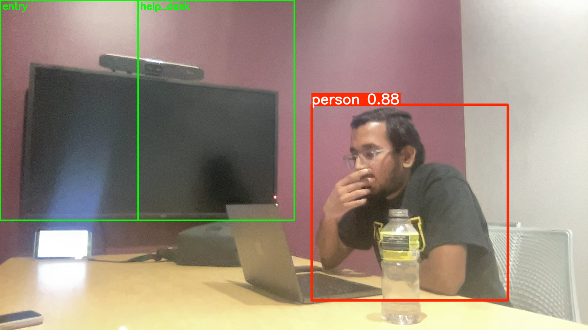
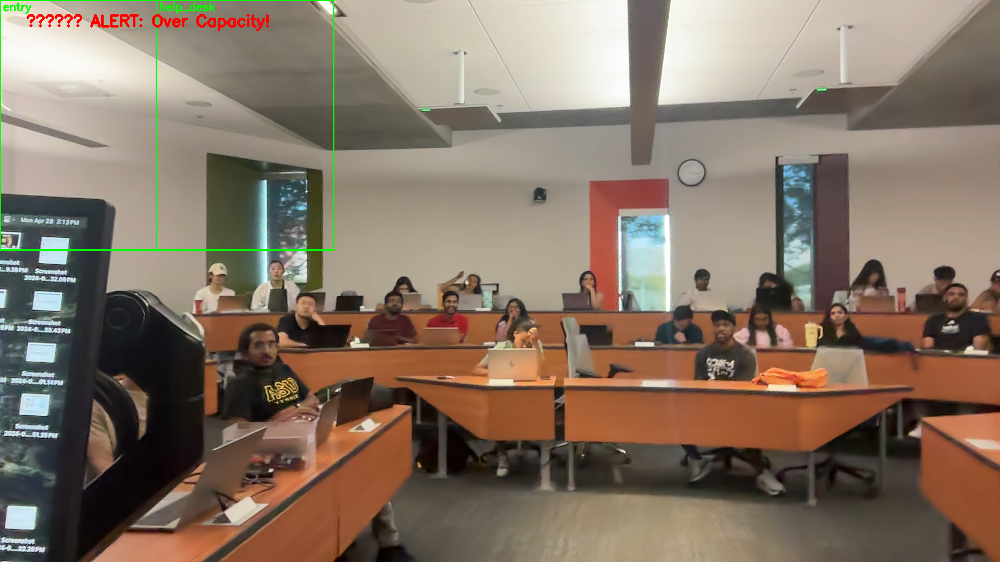

# ASU RoomSense – Real-Time Occupancy Monitoring

A real-time computer vision–powered room occupancy and zone tracking system using YOLOv5 and OpenCV. This system was developed as part of an ASU course project to help university departments optimize space utilization and monitor room usage dynamically.

---

## Objective

Detect and track people entering predefined zones (e.g., entry, help desk) in a closed meeting room, and generate real-time alerts and logs to assist in occupancy planning, capacity management, and staff deployment.

---

## Tools & Technologies

- Python 3.x  
- OpenCV  
- YOLOv5 (pre-trained model)  
- Streamlit (dashboard)  
- CSV logging for occupancy  
- Zone tagging with bounding box logic  

---

## Key Features

-  Real-time person detection using YOLOv5  
-  Dynamic zone mapping (e.g., entry, help_desk)  
-  Occupancy count and CSV log per frame  
-  Alerting logic based on zone thresholds  
-  Streamlit dashboard for real-time demo  

---

## Folder Structure

```
Asu-roomsense/
├── roomsense_live_tracking_zones.py
├── Empty room_frame_100.png
├── single_frame_50.png
├── 2 person frame_0.png
├── 3 person frame_0.png
├── room_occupancy_log.csv (optional)
├── streamlit_dashboard_demo.png (optional)
└── README.md
```


---

## 📸 Sample Output Frames

| Empty Room | Single Person | Two People | Three People |
|------------|---------------|------------|---------------|
|  |  |  |  |

---
## 🚨 Alert Frame Example

This frame was captured when the number of people in the room exceeded a preset zone capacity threshold. The system displays a red alert message and continues logging data for audit or response purposes.



---

##  Sample Output Log (CSV)

| Frame | Timestamp | Entry Zone | Help Desk Zone | Total Persons |
|-------|-----------|------------|----------------|----------------|
| 100   | 12:03:45  | 0          | 0              | 0              |
| 101   | 12:03:47  | 1          | 1              | 2              |
| ...   | ...       | ...        | ...            | ...            |

---

##  Future Enhancements

- Webcam-to-cloud streaming (AWS Lambda or Google Colab)
- Historical occupancy trend analysis
- Dashboard integration with facility booking systems

---


